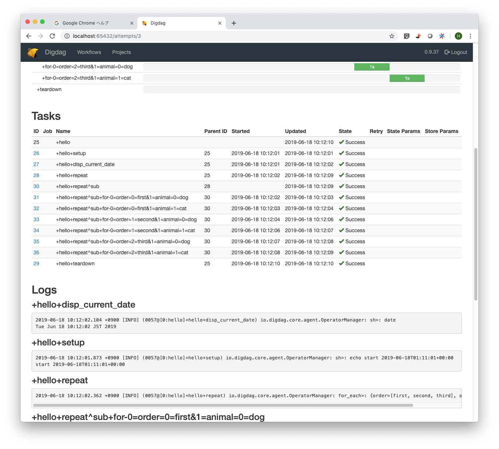

[digdagのWeb UIでログが表示されない](http://nemupooh.parfe.jp/2019/06/14/post-437/)

* digdag: 0.9.37
* OS: macOS 10.14.5
* Chrome: 75.0.3770.90


```
mkdir /tmp/log
digdag server -m -O /tmp/log
```

```
digdag init -t sh hello
cd hello
digdag push hello
```

execute `run` in UI


