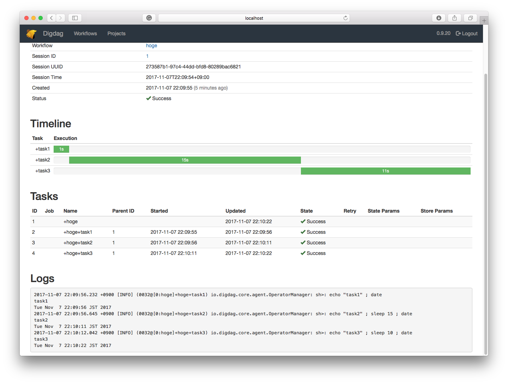

##

```
2017-11-07 22:09:37 +0900: Digdag v0.9.20
2017-11-07 22:09:38 +0900 [INFO] (main): secret encryption engine: disabled
2017-11-07 22:09:38 +0900 [INFO] (main): XNIO version 3.3.6.Final
2017-11-07 22:09:38 +0900 [INFO] (main): XNIO NIO Implementation Version 3.3.6.Final
2017-11-07 22:09:38 +0900 [INFO] (main): Starting server on 127.0.0.1:65432
2017-11-07 22:09:38 +0900 [INFO] (main): Bound on 127.0.0.1:65432 (api)
2017-11-07 22:09:55 +0900 [INFO] (XNIO-1 task-7): Starting a new session project id=1 workflow name=hoge session_time=2017-11-07T22:09:54+09:00
2017-11-07 22:09:56 +0900 [INFO] (0032@[0:hoge]+hoge+task1): sh>: echo "task1" ; date
task1
Tue Nov  7 22:09:56 JST 2017
2017-11-07 22:09:56 +0900 [INFO] (0032@[0:hoge]+hoge+task2): sh>: echo "task2" ; sleep 15 ; date
task2
     # <---- Execute digdag push here
Tue Nov  7 22:10:11 JST 2017
2017-11-07 22:10:12 +0900 [INFO] (0032@[0:hoge]+hoge+task3): sh>: echo "task3" ; sleep 10 ; date
task3
Tue Nov  7 22:10:22 JST 2017
```



