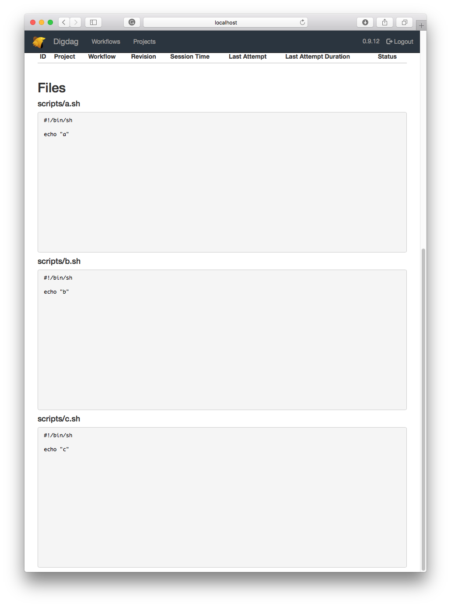

```yaml
timezone: "Asia/Tokyo"

+file_list:
  +task1:
    sh>: ./scripts/a.sh

  +task2:
    sh>: ./scripts/b.sh

  +task3:
    sh>: ./scripts/c.sh
```

```
.
|-- files.dig
`-- scripts
    |-- a.sh
    |-- b.sh
    `-- c.sh
```



