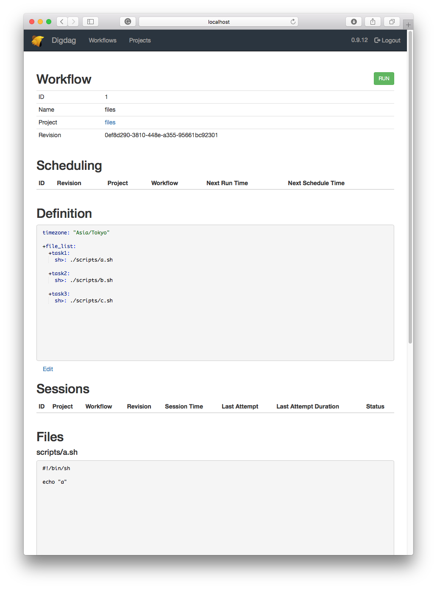

### Server setting

```
digdag server -m
```

### Client setting

```
.
|-- files.dig
`-- scripts
    |-- a.sh
    |-- b.sh
    `-- c.sh
```

```
digdag push
```


```yaml
timezone: "Asia/Tokyo"

+file_list:
  +task1:
    sh>: ./scripts/a.sh

  +task2:
    sh>: ./scripts/b.sh

  +task3:
    sh>: ./scripts/c.sh
```

### access

http://localhost:65432




